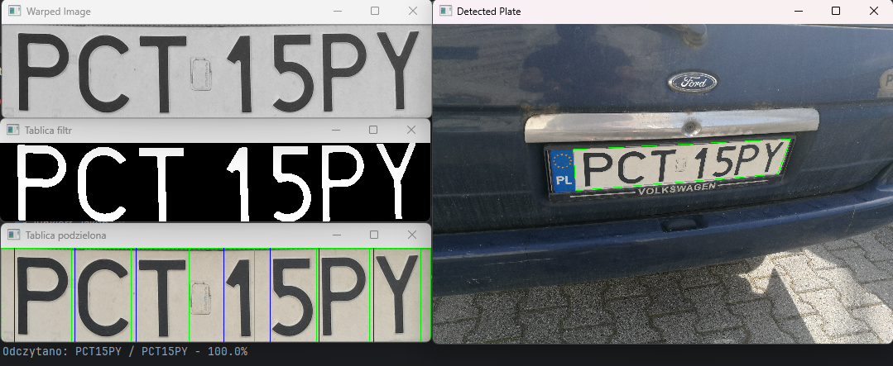

# Vision System Project

## Description

This project aim is to detect and read the license plate of a car.
It uses *OpenCV* and *Scikit-learn* libraries to process the image and detect the license plate characters.



## How does it work?

#### Running the script
The program is run using the *Junkiert_Jakub.py* script.
It takes two arguments - the first one is the name of the folder in which the images are stored, and the second one 
is the name of the output json file.

#### Algorithm

Main script loads the images and for each image it calls the *perform_processing* function from *utils.py*.

The *perform_processing* function performs the following steps:

1. Convert the image to grayscale, apply Gaussian blur and perform Canny edge detection.
```python
gray = cv2.cvtColor(image, cv2.COLOR_BGR2GRAY)
blurred = cv2.GaussianBlur(gray, (11, 11), 1)
edged = cv2.Canny(blurred, 40, 150)
edged = cv2.dilate(edged, np.ones((3,3)), iterations=2)
```

2. Detect contours in the image.
```python
contours, _ = cv2.findContours(edged.copy(), cv2.RETR_TREE, cv2.CHAIN_APPROX_SIMPLE)
```

3. Find contours that are rectangles with appropriate aspect ratio and area.
```python
correct_ar = min_ar < aspect_ratio < max_ar
correct_loc_and_size = np.all(approx != 0)
correct_area = 10**8 > cv2.contourArea(contour) > 10**5
correct_width = w > image.shape[1]/3

if correct_ar and correct_loc_and_size and correct_area and correct_width:
```

4. Perform perspective transformation to get the license plate only.
```python
license_plate_img = cv2.warpPerspective(image, M, (520, 114))
```

5. If two previous steps were successful, it means that the license plate was likely found and the program can continue.

6. Apply adaptive thresholding to the license plate image and crop it.
```python
_, license_plate_filtered = cv2.threshold(license_plate_img, 150, 255, cv2.ADAPTIVE_THRESH_GAUSSIAN_C)
license_plate_filtered = cv2.erode(license_plate_filtered, np.ones((5,5)))
license_plate_filtered = cv2.dilate(license_plate_filtered, np.ones((3,3)))
```

7. Scan the cropped image for characters. It is done by checking every column if it has black pixels. If it does, it 
   means that there is probably a character in this column.
```python
# Scan the license plate to detect the letters
x_scan = np.zeros((license_plate_filtered.shape[1]))
for i in range(0, license_plate_filtered.shape[1]):
    for j in range(0, license_plate_filtered.shape[0]):
        if license_plate_filtered[j, i] == 255:
            x_scan[i] = True
            break
        else:
            x_scan[i] = False
```

8. Detect every start and end x position of the characters, crop them and resize so every character would be 80x95 px.

9. Use the trained model to predict the characters.
```python
read_letter = ocr_model.predict([char_to_ocr.flatten()])[0]
```

10. Return string with the read license plate.

#### Training the model

To train the model, first, the dataset with characters is needed. It can be created by uncommenting the following lines:

```python
# Save the detected letter to folder 'train_letters' used to train OCR model
cv2.waitKey(1)
char_name = input('Podaj znak: ')
cv2.destroyWindow('litera')
name = 'train_letters/' + str(char_name) + '_' + str(np.random.randint(0, 10000)) + '.png'
cv2.imwrite(name, char_to_ocr)
```

After detecting the characters boundaries, the script ask user for every found character. It then saves images of 
these to the folder *train_letters*, with first letter being the character itself and the rest being random numbers 
for being able to have more than one example of every letter.

After creating the dataset, the model can be trained by running the *ocr_model.py* script.
It loads the images from the *train_letters* folder, converts them to python lists and trains the model using 
*Scikit-learn*.

The model is simple and uses SVC (Support Vector Classifier).

After fitting, the model is saved to file, which is then loaded in the main script.

## Project files

- *Junkiert_Jakub.py* - main script
- *utils.py* - script containing *perform_processing* function, which is used to process the image and find license plate
- *ocr_model.py* - script used to train the OCR model
- *image_renaming.py* - script used to rename images in the folder, used for manually renaming files to contain license plate number
- *train_letters* - folder containing images of characters used to train the OCR model
- *models/model.pkl* - file containing the trained model
- *README.md* - this file
- *requirements.txt* - file containing the required libraries
